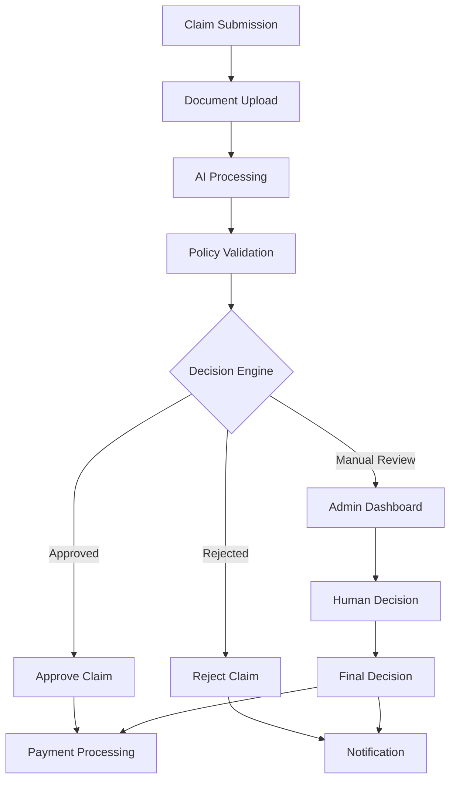
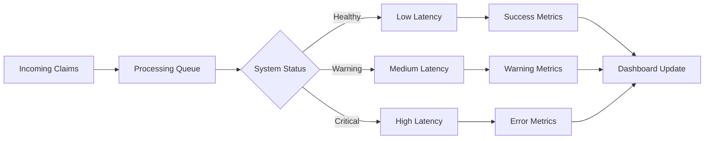
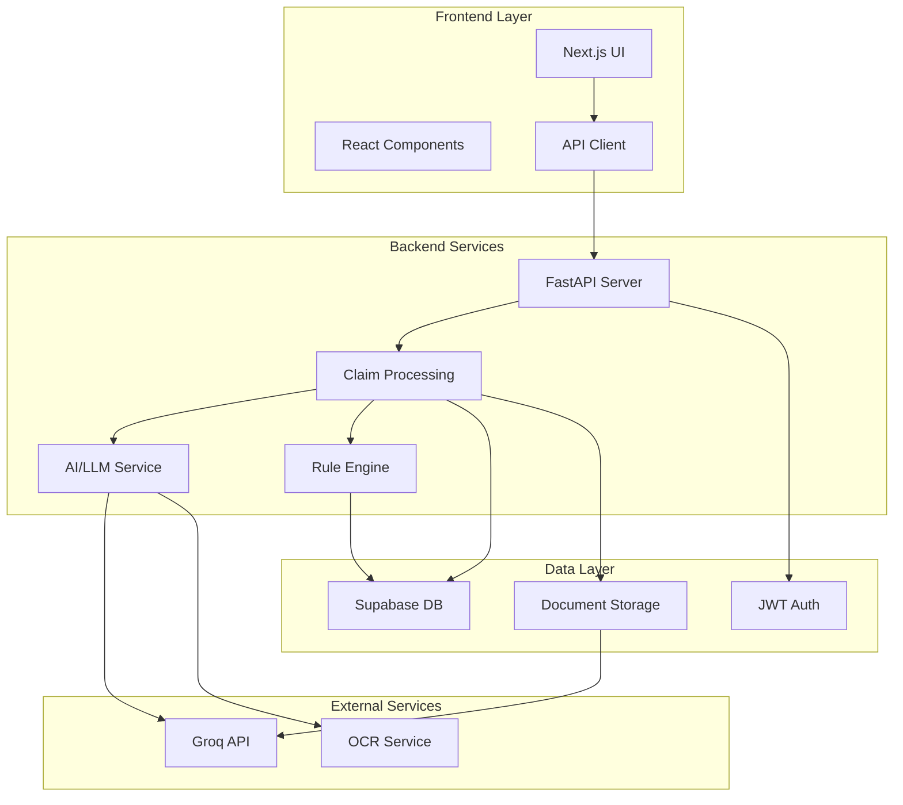
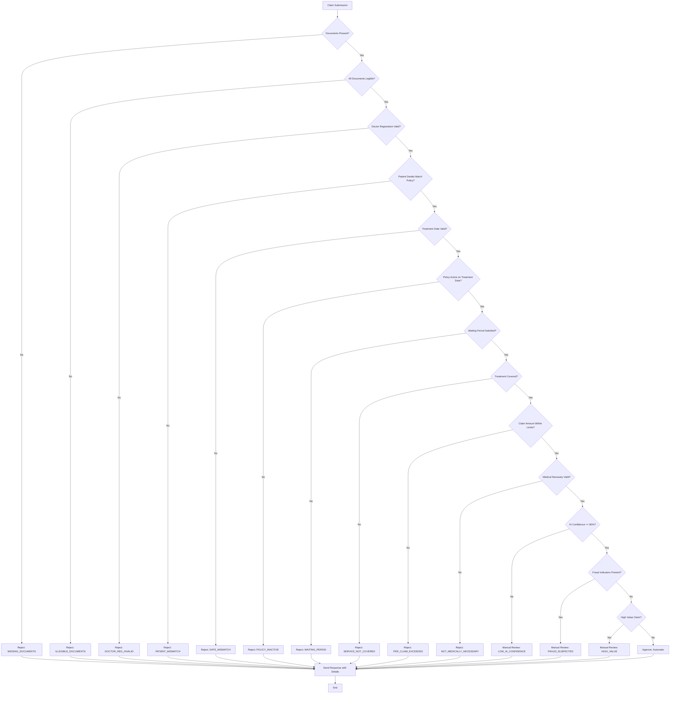
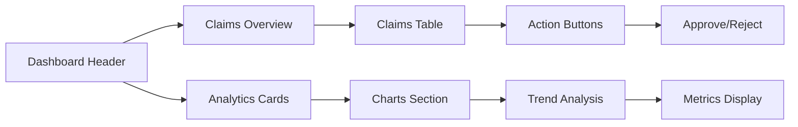
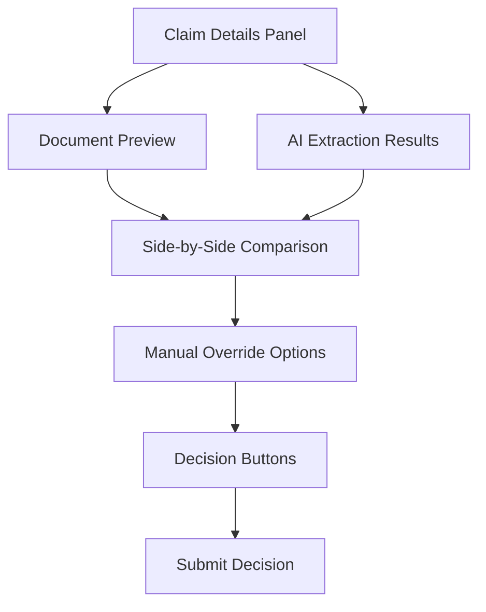

# 🏥 Plum Claim Adjudicator AI - Next-Gen Health Claims Platform

[](https://fastapi.tiangolo.com)
[](https://nextjs.org)
[](https://supabase.com)
[](https://groq.com)

This engine automates the processing of health insurance claims, using a rule-based engine for policy validation and an LLM (Large Language Model) for interpreting complex medical documents. It features a modern Admin Dashboard for real-time monitoring and manual review of flagged claims.

## 🚀 Overview

This engine automates the processing of health insurance claims, using a rule-based engine for policy validation and an LLM (Large Language Model) for interpreting complex medical documents. It features a modern Admin Dashboard for real-time monitoring and manual review of flagged claims.

### Main Adjudication Dashboard Overview:



## ✨ Key Features

### 1. Automated Adjudication

**Rule Engine**: Validates claims against policy terms (min/max amounts, exclusions).

**AI Analysis**: Uses LLMs to extract and verify diagnosis codes and treatment details from medical documents.

**Instant Decisions**: Automatically approves or rejects clear-cut cases.

### 2. Manual Review Workflow

**Human-in-the-Loop**: Flagged claims (e.g., low confidence, high value) are routed to a review queue.

**Decision Support**: Reviewers see a side-by-side view of the claim data and the AI's analysis.

**One-Click Actions**: Approve or reject claims directly from the UI.

### 3. System Metrics Dashboard

**Real-Time Monitoring**: Track total request volume, API latency, and active requests.

**Traffic Analysis**: Visualize response status codes (2xx, 4xx, 5xx) and top API endpoints.

**Live Charts**: Dynamic charts powered by Recharts for instant visibility into system health.



## 🛠️ Tech Stack

**Backend**: Python, FastAPI, Pydantic (Data Validation), Supabase (Database)

**Frontend**: Next.js, TypeScript, Tailwind CSS, Recharts, Radix UI

**AI/ML**: Groq API (LLM), OCR for document processing

**Infrastructure**: Vercel (Frontend), Render (Backend), Supabase (Database/Storage)

## 🏗️ System Architecture

The system follows a modern Event-Driven Microservices Architecture, ensuring scalability, fault tolerance, and asynchronous processing.



## 🔄 Adjudication Decision Flow

The rules engine processes extracted data through a series of strict validation steps:



## 🏁 Quick Start

### Prerequisites

- Python 3.10+
- Node.js 18+
- Git

### Backend Setup

```bash
cd backend
pip install -r requirements.txt
uvicorn app.main:app --reload
```

### Frontend Setup

```bash
cd frontend
npm install
npm run dev
```

## 📸 Screenshots

### Admin Dashboard



### Manual Review Interface



## 📊 Admin Dashboard Features:

**Authentication**: Secure login with role-based access control.

**Policy Management**: View and edit policy rules in real-time.

**System Metrics**: Live dashboard showing Request Volume and API Latency.

**Overview Stats**: Approval rates, total claims, and AI confidence metrics.

**Real-time Dashboard**: A modern, responsive Next.js UI to upload claims, view processing status in real-time, and see detailed adjudication results including approved amounts and rejection reasons.

**Transparent Decisioning**: Provides clear reasons for every rejection or partial approval, along with a confidence score for the AI's extraction.

## 🛠️ Technical Stack & Key Decisions

### Frontend (User Experience)

- **Framework**: Next.js 14 with App Router for optimized performance.
- **Styling**: Tailwind CSS for utility-first styling, ensuring a responsive and modern design.
- **State Management**: React Hooks (useState, useEffect) for local state with Context API for global state.
- **Design System**: Custom "Enterprise" theme with deep indigo hues, glassmorphism effects, and premium typography.

### Backend (Core Logic)

- **API**: FastAPI (Python) for high-performance, async-ready endpoints.
- **Data Validation**: Pydantic models for strict data validation and serialization.
- **Storage**: Supabase (PostgreSQL) for reliable relational data persistence.
- **Authentication**: JWT-based authentication with secure token handling.

### Intelligence Layer

- **OCR**: Groq API (Llama 3.3 70B) for context-aware extraction of medical data.
- **AI Processing**: Advanced LLM integration for cross-document verification.
- **Rules Engine**: A deterministic Python-based engine that enforces policy limits, exclusions, and co-pays strictly.

## 🌐 Live Deployment

- **Frontend App**: [https://claim-adjudicator-ai.vercel.app/](https://claim-adjudicator-ai.vercel.app/)
- **Backend API**: [https://adjudicator-backend.onrender.com](https://adjudicator-backend.onrender.com)

## 📁 Project Structure

```
├── backend/
│   ├── app/
│   │   ├── api/          # FastAPI Routes
│   │   ├── services/     # Adjudicator, AI Extractor, Store, PDF Gen
│   │   ├── schemas/      # Pydantic Models (Unified Domain Model)
│   │   └── core/         # Config & Security
│   ├── config/           # Policy Terms (JSON Rules)
│   ├── data/             # Sample Claims Data
│   └── tests/            # Pytest Suite
├── frontend/
│   ├── app/              # Next.js Pages (Dashboard, Track, Admin)
│   ├── components/       # UI Components (Split-Screen, Charts)
│   └── lib/              # API Client & Utils
└── Given/                # Original Assignment Guidelines
```

## 🚀 How to Run

### Option 1: Local Development

1. Clone the repository:

```bash
git clone https://github.com/NARAsimha654/claim-adjudicator-ai.git
cd claim-adjudicator-ai
```

2. Set up environment variables:
   Create `.env.local` in the frontend directory:

```env
NEXT_PUBLIC_API_URL=http://localhost:8000
```

Create `.env` in the backend directory:

```env
GROQ_API_KEY=your_groq_api_key
SUPABASE_URL=your_supabase_project_url
SUPABASE_KEY=your_supabase_anon_public_key
SUPABASE_BUCKET=claim-documents
```

3. Run the backend:

```bash
cd backend
pip install -r requirements.txt
uvicorn app.main:app --reload
```

4. Run the frontend:

```bash
cd frontend
npm install
npm run dev
```

The application will be available at:

- Frontend: http://localhost:3000
- Backend API: http://localhost:8000/docs

### Option 2: Using Docker (Coming Soon)

Docker configuration will be added in future releases for easier deployment.

## 🧪 Testing

Run backend tests:

```bash
cd backend
pytest
```

## 📈 Assumptions Made

- **Document Quality**: Medical documents are of reasonable quality for AI processing
- **Network Reliability**: External APIs (Groq, Supabase) are consistently available
- **User Training**: Admin users have basic computer literacy
- **Policy Consistency**: Policy terms remain stable during processing
- **Data Format**: Medical documents follow standard formats
- **Security**: All API communications are secured with HTTPS
- **Scalability**: System can handle up to 1000 claims per day initially
- **Audit Requirements**: All decisions need to be traceable and auditable

## 🚨 Known Limitations

- Handwritten prescriptions may have lower AI extraction accuracy
- Multi-language documents require additional processing
- Complex medical terminology may need special handling
- High-volume scenarios need performance optimization

## 🤝 Contributing

1. Fork the repository
2. Create a feature branch (`git checkout -b feature/amazing-feature`)
3. Commit changes (`git commit -m 'Add amazing feature'`)
4. Push to the branch (`git push origin feature/amazing-feature`)
5. Open a Pull Request

## 📄 License

This project is part of the Plum AI Automation Engineer Intern Assignment.

## 📞 Support

For support, please contact the project maintainers through GitHub issues.
