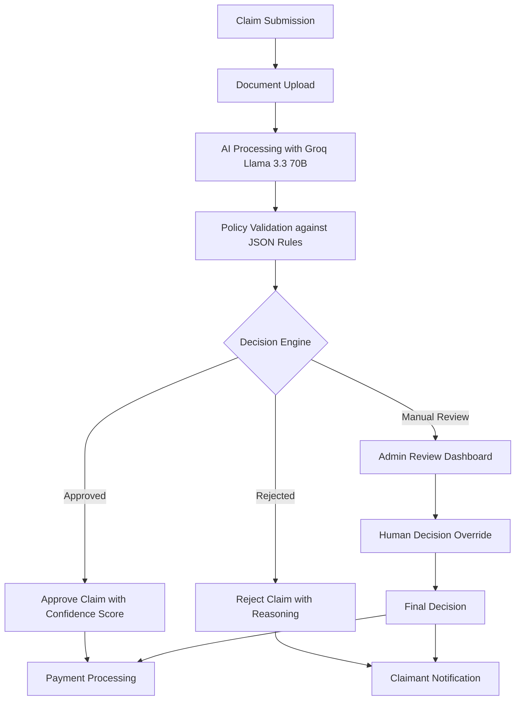
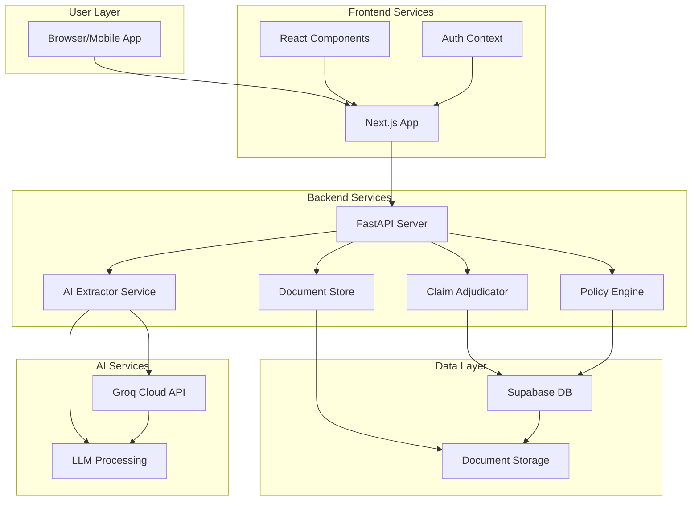
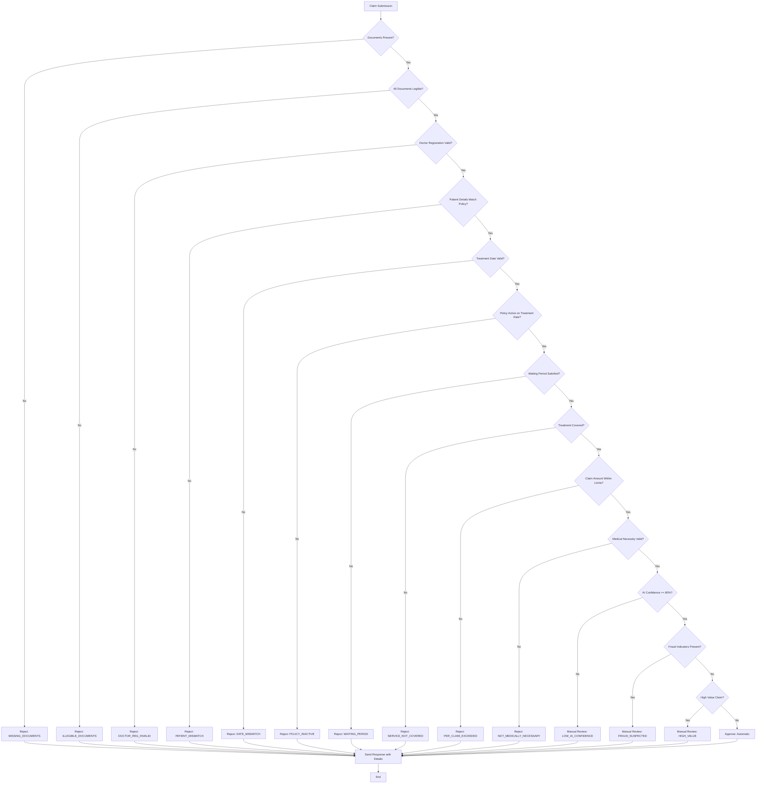

# 🏥 Plum Claim Adjudicator AI - Next-Gen Health Claims Platform

[](https://fastapi.tiangolo.com)
[](https://nextjs.org)
[](https://supabase.com)
[](https://groq.com)

A professional, cloud-native automated health insurance adjudication platform. This system processes medical documents using AI, validates them against strict insurance policies, and provides a high-fidelity workspace for human-in-the-loop review.

## 🚀 Overview

This engine automates the processing of health insurance claims, using a rule-based engine for policy validation and an LLM (Large Language Model) for interpreting complex medical documents. It features a modern Admin Dashboard for real-time monitoring and manual review of flagged claims.

### Main Adjudication Dashboard Overview:


## ✨ Key Features

### 1. Multi-Doc AI Extraction
- **Contextual OCR**: Uses **Groq (Llama 3.3 70B)** to cross-verify data between medical bills and prescriptions.
- **Fraud Detection**: Identifies mismatches in hospital names, dates, or items billed but not prescribed.
- **Confidence Scoring**: Automatically flags claims for manual review if AI confidence drops below 80%.

### 2. Ultimate Admin Workspace
- **Split-Screen Review**: Side-by-side view of the original document content vs. the AI-extracted data.
- **Inline Corrections**: Allows admins to override AI fields or verdicts with manual notes.
- **Unified Analytics**: Real-time stats on approval rates, money saved, and AI performance.

### 3. Enterprise-Grade Security
- **JWT Authentication**: Secure user sessions with role-based access.
- **Document Isolation**: Encrypted storage with granular access controls.
- **Audit Trails**: Complete log of all decisions and manual interventions.

### 4. System Metrics Dashboard
- **Real-Time Monitoring**: Track total request volume, API latency, and active requests.
- **Traffic Analysis**: Visualize response status codes (2xx, 4xx, 5xx) and top API endpoints.
- **Live Charts**: Dynamic charts powered by Recharts for instant visibility into system health.

## 🛠️ Tech Stack

**Frontend**: Next.js 14, TypeScript, Tailwind CSS, Recharts, Radix UI, Framer Motion

**Backend**: Python, FastAPI, Pydantic, Supabase (Database)

**AI/ML**: Groq API (Llama 3.3 70B), OCR for document processing

**Infrastructure**: Vercel (Frontend), Render (Backend), Supabase (Database/Storage)

## 🏗️ System Architecture

The system follows a modern microservices architecture with clear separation of concerns:



## 🔄 Adjudication Decision Flow

The rules engine processes extracted data through a series of strict validation steps:



## 🏁 Quick Start

### Prerequisites

- Python 3.10+
- Node.js 18+
- Git
- Groq API Key

### Backend Setup

```bash
cd backend
pip install -r requirements.txt
uvicorn app.main:app --reload
```

### Frontend Setup

```bash
cd frontend
npm install
npm run dev
```

## 📊 Admin Dashboard Features:

**Authentication**: Secure login with role-based access control.

**Policy Management**: View and edit policy rules in real-time.

**System Metrics**: Live dashboard showing Request Volume and API Latency.

**Overview Stats**: Approval rates, total claims, and AI confidence metrics.

**Real-time Dashboard**: A modern, responsive Next.js UI to upload claims, view processing status in real-time, and see detailed adjudication results including approved amounts and rejection reasons.

**Transparent Decisioning**: Provides clear reasons for every rejection or partial approval, along with a confidence score for the AI's extraction.

## 🛠️ Technical Stack & Key Decisions

### Frontend (User Experience)
- **Framework**: Next.js 14 with App Router for optimized performance.
- **Styling**: Tailwind CSS for utility-first styling, ensuring a responsive and modern design.
- **Animations**: Framer Motion for fluid, professional UI transitions (e.g., entry animations, hover states).
- **State Management**: React Hooks (useState, useEffect) for local state; Context API for global state management.
- **Design System**: Custom "Enterprise" theme with deep indigo hues, glassmorphism effects, and premium typography (Geist/Geist Mono fonts).

### Backend (Core Logic)
- **API**: FastAPI (Python) for high-performance, async-ready endpoints.
- **Data Validation**: Pydantic models for strict data validation and serialization.
- **Storage**: Supabase (PostgreSQL) for reliable relational data persistence.
- **Authentication**: JWT-based authentication with secure token handling.

### Intelligence Layer
- **OCR**: Groq API (Llama 3.3 70B) for context-aware extraction of medical data.
- **AI Processing**: Advanced LLM integration for cross-document verification.
- **Rules Engine**: A deterministic Python-based engine that enforces policy limits, exclusions, and co-pays strictly.

## 🌐 Live Deployment

- **Frontend App**: [https://claim-adjudicator-ai.vercel.app/](https://claim-adjudicator-ai.vercel.app/)
- **Backend API**: [https://adjudicator-backend.onrender.com](https://adjudicator-backend.onrender.com)

## 📁 Project Structure

```
├── backend/
│   ├── app/
│   │   ├── api/          # FastAPI Routes
│   │   ├── services/     # Adjudicator, AI Extractor, Store, PDF Gen
│   │   ├── schemas/      # Pydantic Models (Unified Domain Model)
│   │   └── core/         # Config & Security
│   ├── config/           # Policy Terms (JSON Rules)
│   ├── data/             # Sample Claims Data
│   └── tests/            # Pytest Suite
├── frontend/
│   ├── app/              # Next.js Pages (Dashboard, Track, Admin)
│   ├── components/       # UI Components (Split-Screen, Charts)
│   └── lib/              # API Client & Utils
└── Given/                # Original Assignment Guidelines
```

## 🚀 How to Run

### Option 1: Local Development

1. Clone the repository:
```bash
git clone https://github.com/NARAsimha654/claim-adjudicator-ai.git
cd claim-adjudicator-ai
```

2. Set up environment variables:
Create `.env.local` in the frontend directory:
```env
NEXT_PUBLIC_API_URL=http://localhost:8000
```

Create `.env` in the backend directory:
```env
GROQ_API_KEY=your_groq_api_key
SUPABASE_URL=your_supabase_project_url
SUPABASE_KEY=your_supabase_anon_public_key
SUPABASE_BUCKET=claim-documents
```

3. Run the backend:
```bash
cd backend
pip install -r requirements.txt
uvicorn app.main:app --reload
```

4. Run the frontend:
```bash
cd frontend
npm install
npm run dev
```

The application will be available at:
- Frontend: http://localhost:3000
- Backend API: http://localhost:8000/docs

## 🧪 Testing

Run backend tests:
```bash
cd backend
pytest
```

## 📈 Assumptions Made

- **Document Quality**: Medical documents are of reasonable quality for AI processing
- **Network Reliability**: External APIs (Groq, Supabase) are consistently available
- **User Training**: Admin users have basic computer literacy
- **Policy Consistency**: Policy terms remain stable during processing
- **Data Format**: Medical documents follow standard formats
- **Security**: All API communications are secured with HTTPS
- **Scalability**: System can handle up to 1000 claims per day initially
- **Audit Requirements**: All decisions need to be traceable and auditable

## 🚨 Known Limitations

- Handwritten prescriptions may have lower AI extraction accuracy
- Multi-language documents require additional processing
- Complex medical terminology may need special handling
- High-volume scenarios need performance optimization

## 🤝 Contributing

1. Fork the repository
2. Create a feature branch (`git checkout -b feature/amazing-feature`)
3. Commit changes (`git commit -m 'Add amazing feature'`)
4. Push to the branch (`git push origin feature/amazing-feature`)
5. Open a Pull Request

## 📄 License

This project is part of the Plum AI Automation Engineer Intern Assignment.

## 📞 Support

For support, please contact the project maintainers through GitHub issues.