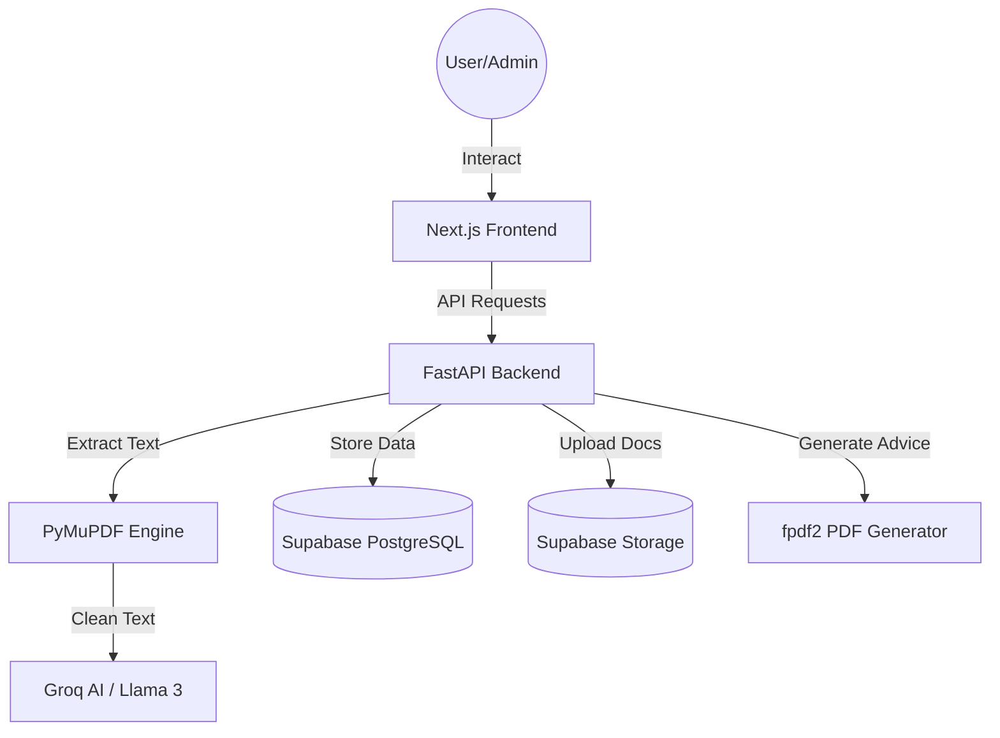

# 🏥 Strict AI Adjudicator: Next-Gen Health Claims Platform

[](https://fastapi.tiangolo.com)
[](https://nextjs.org)
[](https://supabase.com)
[](https://groq.com)

A professional, cloud-native automated health insurance adjudication platform. This system processes medical documents using AI, validates them against strict insurance policies, and provides a high-fidelity workspace for human-in-the-loop review.

---

## 🚀 Key Features

### 1. **Multi-Doc AI Extraction**
- **Contextual OCR**: Uses **Groq (Llama 3.3 70B)** to cross-verify data between medical bills and prescriptions.
- **Fraud Detection**: Identifies mismatches in hospital names, dates, or items billed but not prescribed.
- **Confidence Scoring**: Automatically flags claims for manual review if AI confidence drops below 80%.

### 2. **Ultimate Admin Workspace**
- **Split-Screen Review**: Side-by-side view of the original document content vs. the AI-extracted data.
- **Inline Corrections**: Allows admins to override AI fields or verdicts with manual notes.
- **Unified Analytics**: Real-time stats on approval rates, money saved, and AI performance.

### 3. **Policy Engine & Simulator**
- **Deterministic Rules**: Enforces co-pays (e.g., 10% on consultations), sub-limits, and waiting periods.
- **Backtesting Drive**: A "What-If" simulator that allows managers to run historical claims through new policy rules to predict financial impact.

### 4. **Member Experience**
- **Guest Tracking**: Simple tracking interface for members to check claim status without logging in.
- **Settlement PDFs**: Generates professional "Settlement Advice" PDFs using `fpdf2` upon approval.

---

## 🛠️ Tech Stack

- **Backend**: Python 3.10+ | FastAPI | Pydantic v2
- **Frontend**: Next.js 14 | TypeScript | Tailwind CSS | Lucide Icons
- **AI Layer**: Groq API (Llama 3.3 70B) | PyMuPDF (OCR extraction)
- **Cloud Infrastructure**: 
  - **Database**: Supabase (PostgreSQL)
  - **Storage**: Supabase Buckets (Medical Docs)
  - **Hosting**: Render (Backend Dockerized) | Vercel (Frontend)

---

## 🏗️ Architecture Diagram



---

## 🏁 Quick Start

### 1. Prerequisites
- Python 3.10+
- Node.js 18+
- Supabase Account (Free tier)
- Groq API Key

### 2. Backend Setup
```bash
cd backend
python -m venv .venv
# Windows
.venv\Scripts\activate 
# Linux/Mac
source .venv/bin/activate

pip install -r requirements.txt
# Create a .env file with your variables
uvicorn app.main:app --reload
```

### 3. Frontend Setup
```bash
cd frontend
npm install
# Create a .env.local with NEXT_PUBLIC_API_URL
npm run dev
```

---

## ⚙️ Environment Variables (.env)

| Key | Description |
|---|---|
| `GROQ_API_KEY` | Your Groq Cloud API Key |
| `SUPABASE_URL` | Your Supabase project URL |
| `SUPABASE_KEY` | Your Supabase Anon Public Key |
| `SUPABASE_BUCKET` | Name of your storage bucket (default: `claim-documents`) |
| `NEXT_PUBLIC_API_URL` | URL of the backend (e.g., `http://127.0.0.1:8000`) |

---

## 📂 Project Structure

```text
├── backend/
│   ├── app/
│   │   ├── api/          # FastAPI Routes
│   │   ├── services/     # Adjudicator, AI Extractor, Store, PDF Gen
│   │   ├── schemas/      # Pydantic Models (Unified Domain Model)
│   │   └── core/         # Config & Security
│   ├── config/           # Policy Terms (JSON Rules)
│   ├── tests/            # Pytest Suite
│   └── Dockerfile        # Deployment configuration
├── frontend/
│   ├── app/              # Next.js Pages (Dashboard, Track, Admin)
│   ├── components/       # UI Components (Split-Screen, Charts)
│   └── lib/              # API Client & Utils
└── Given/                # Original Assignment Guidelines
```

---

## ⚖️ Assumptions & Disclaimers
1. **Network Status**: Hospitals are identified as "Network" if they match the predefined list in `policy_terms.json`.
2. **Statelessness**: The backend stores no files locally; it relies entirely on Supabase for a cloud-native, scalable experience.
3. **Identity**: Patient names are verified against Member IDs during the Extraction phase.

---

### 👨‍💻 Author
**Narasimha**  
*AI Automation Engineer Intern Project - Plum*
