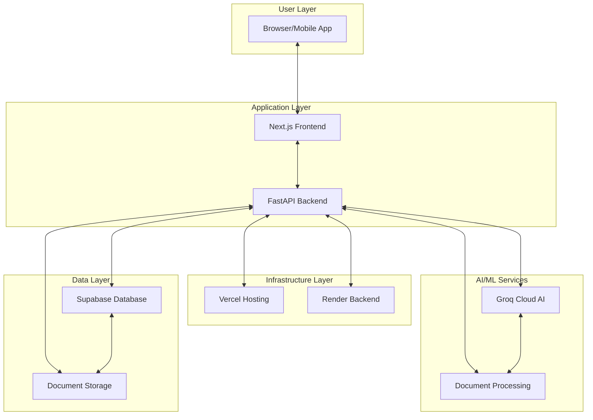
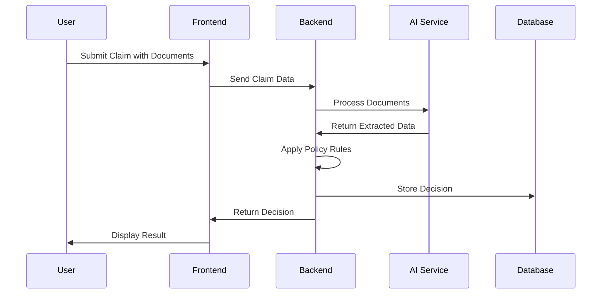
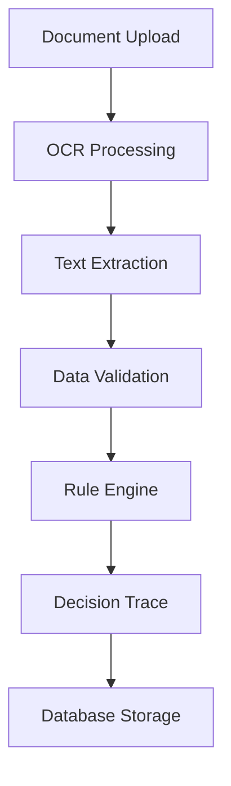
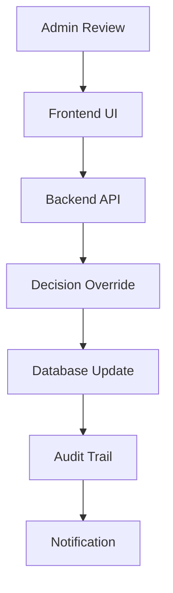
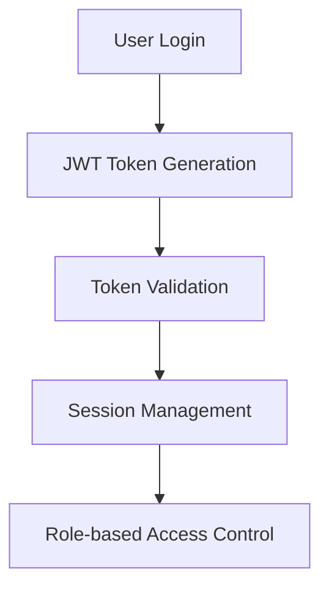
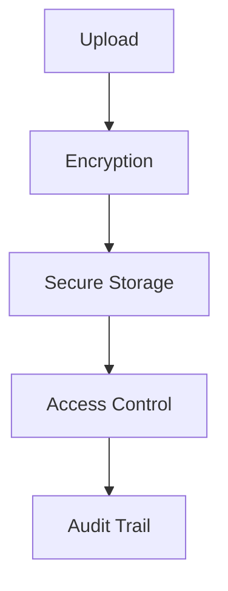
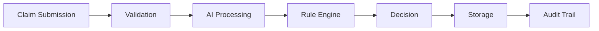
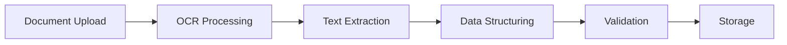
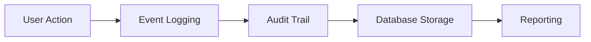

# Architecture Diagram

## System Architecture Overview

## Component Interaction Flow

### 1. Claim Submission Flow

### 2. Document Processing Flow

### 3. Decision Override Flow

## Technology Stack Layers

### Presentation Layer

- **Next.js 14**: React-based frontend framework
- **TypeScript**: Type-safe JavaScript
- **Tailwind CSS**: Utility-first CSS framework
- **Radix UI**: Accessible component primitives

### Application Layer

- **FastAPI**: Python web framework with automatic API documentation
- **Pydantic**: Data validation and settings management
- **Python 3.10+**: Backend language

### AI/ML Layer

- **Groq Cloud**: AI inference platform
- **Llama 3.3 70B**: Large language model for document understanding
- **OCR Processing**: Text extraction from medical documents

### Data Layer

- **Supabase**: PostgreSQL database with real-time capabilities
- **Supabase Storage**: Document storage with access controls
- **JWT Authentication**: Secure session management

### Infrastructure Layer

- **Vercel**: Frontend deployment and hosting
- **Render**: Backend deployment and hosting
- **GitHub**: Source code management
- **Environment Variables**: Secure configuration management

## Security Architecture

### Authentication Flow

### Document Security

## Scalability Considerations

### Current Architecture

- **Monolithic Backend**: Single FastAPI application
- **Serverless Frontend**: Next.js app deployed on Vercel
- **Managed Services**: Supabase for database and storage

### Future Scalability

- **Microservices**: Split into independent services
- **Caching Layer**: Redis for frequently accessed data
- **CDN**: For static assets and document delivery
- **Load Balancer**: For handling high traffic scenarios

## Data Flow Architecture

### Claim Data Flow

### Document Data Flow

### Audit Data Flow

