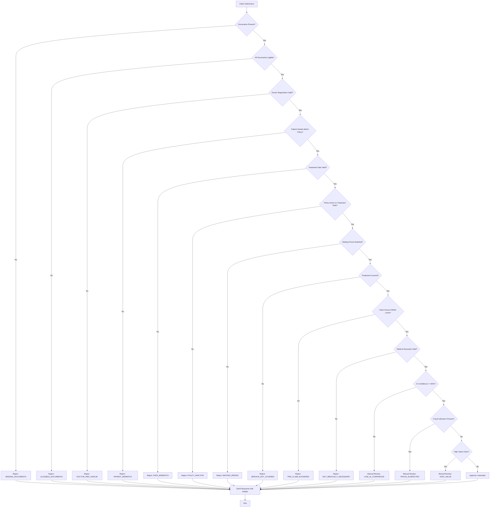

# Decision Logic Flowchart

## Claim Adjudication Process

### Main Decision Flow



## Detailed Decision Steps

### Step 1: Document Validation

- Check if all required documents are present
- Verify document legibility using OCR confidence scores
- Validate document authenticity (stamps, signatures, headers)

### Step 2: Provider Verification

- Validate doctor's registration number format and existence
- Check if hospital is in network or non-network
- Verify clinic/hospital registration status

### Step 3: Patient Verification

- Match patient details with policy records
- Verify member ID and coverage status
- Check dependent relationships if applicable

### Step 4: Temporal Validation

- Verify treatment date is not in the future
- Check document dates are consistent
- Validate submission timeline (within 30 days)

### Step 5: Policy Eligibility

- Check if policy was active on treatment date
- Verify waiting periods have been satisfied
- Validate coverage type (individual/family floater)

### Step 6: Coverage Verification

- Compare treatment against covered services list
- Check if treatment is in exclusion list
- Verify pre-authorization requirements

### Step 7: Limit Validation

- Check annual limit (current year + claimed amount)
- Validate per-claim limit
- Verify sub-limits (consultation, pharmacy, diagnostics)
- Apply co-payment calculations

### Step 8: Medical Necessity

- Validate diagnosis justifies treatment
- Check prescription aligns with diagnosis
- Verify test results support diagnosis
- Ensure treatment follows medical protocols

### Step 9: AI Confidence Check

- If AI confidence < 80%, flag for manual review
- High confidence claims proceed to final checks
- Low confidence claims go to human review

### Step 10: Fraud Detection

- Check for duplicate claims
- Identify unusual patterns
- Validate provider consistency
- Cross-check with historical data

## Decision Categories

### Automatic Approval

- All checks pass
- High AI confidence
- No fraud indicators
- Within all limits
- Standard processing

### Automatic Rejection

- Missing documents
- Invalid doctor registration
- Non-covered services
- Exceeded limits
- Policy inactive
- Waiting period not satisfied

### Manual Review Required

- Low AI confidence (<80%)
- High-value claims (>₹25,000)
- Fraud indicators detected
- Complex medical conditions
- Member appeals automated decision

## Confidence Scoring

### AI Confidence Factors

- Document quality (OCR accuracy)
- Text clarity and completeness
- Consistency across documents
- Medical terminology accuracy
- Data extraction reliability

### Rule Confidence Factors

- Policy term clarity
- Data validation certainty
- Historical pattern matching
- Exception handling certainty

## Rejection Categories

### Eligibility Issues

- `POLICY_INACTIVE`: Policy not active on treatment date
- `WAITING_PERIOD`: Treatment during waiting period
- `MEMBER_NOT_COVERED`: Claimant not found in policy records

### Documentation Issues

- `MISSING_DOCUMENTS`: Required documents not submitted
- `ILLEGIBLE_DOCUMENTS`: Documents not readable
- `INVALID_PRESCRIPTION`: Prescription missing or invalid
- `DOCTOR_REG_INVALID`: Doctor registration number invalid/missing
- `DATE_MISMATCH`: Document dates don't match
- `PATIENT_MISMATCH`: Patient details don't match records

### Coverage Issues

- `SERVICE_NOT_COVERED`: Treatment/service not covered
- `EXCLUDED_CONDITION`: Condition in exclusions list
- `PRE_AUTH_MISSING`: Pre-authorization required but not obtained

### Limit Issues

- `ANNUAL_LIMIT_EXCEEDED`: Annual limit exhausted
- `SUB_LIMIT_EXCEEDED`: Category sub-limit exceeded
- `PER_CLAIM_EXCEEDED`: Single claim limit exceeded

### Medical Issues

- `NOT_MEDICALLY_NECESSARY`: Treatment not justified by diagnosis
- `EXPERIMENTAL_TREATMENT`: Experimental/unproven treatment
- `COSMETIC_PROCEDURE`: Cosmetic/aesthetic procedure

### Process Issues

- `LATE_SUBMISSION`: Submitted after 30-day deadline
- `DUPLICATE_CLAIM`: Same treatment already claimed
- `BELOW_MIN_AMOUNT`: Claim below ₹500 minimum

## Approval Logic

### Full Approval Conditions

- All validation steps pass
- Claim amount within all applicable limits
- Treatment is covered under policy
- Medical necessity established
- No fraud indicators

### Partial Approval Conditions

- Part of treatment is covered, part is not
- Claim exceeds limits (approve up to limit)
- Co-payment applies (approve net amount after co-pay)

### Approval Amount Calculation

```
Approved Amount = Min(Claimed Amount, Per-Claim Limit, Available Annual Limit)
Approved Amount = Approved Amount - Co-pay Amount - Deductions
```

## Audit Trail Requirements

Every decision must include:

- Complete decision trace showing each step
- Confidence scores for AI and rules
- Rejection reasons if applicable
- Failed rules if any
- Notes for manual review cases
- Next steps for claimant
