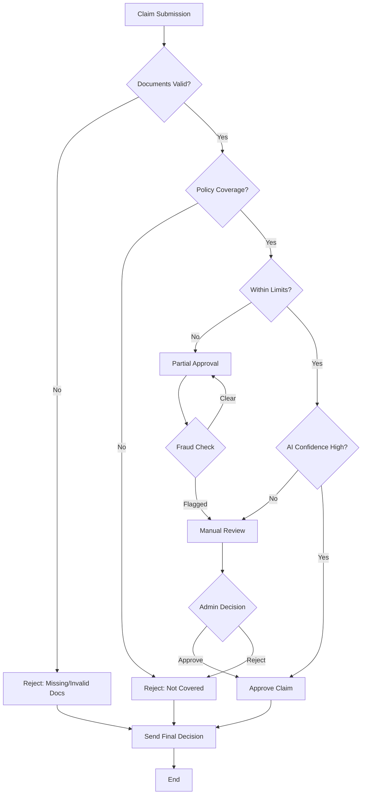

# Decision Logic Flowchart

## Simplified Claim Adjudication Process

### Main Decision Flow

## Decision Steps Overview

### Step 1: Document Validation

- Check if all required documents are present and legible
- Verify document authenticity

### Step 2: Policy Coverage Check

- Validate if treatment is covered under policy terms
- Check against exclusions list

### Step 3: Limit Validation

- Verify claim amount within policy limits
- Apply co-payment calculations if needed

### Step 4: AI Confidence Check

- If AI confidence is high (>80%), proceed to approval
- If AI confidence is low, flag for manual review

### Step 5: Fraud Detection

- Check for potential fraud indicators
- If flagged, send to manual review

### Step 6: Final Decision

- Automatic approval for clear cases
- Manual review for complex cases
- Final decision with detailed reasoning

## Decision Categories

### Automatic Approval

- All checks pass
- High AI confidence
- No fraud indicators
- Within all limits

### Automatic Rejection

- Missing or invalid documents
- Non-covered services
- Exceeded limits

### Manual Review Required

- Low AI confidence (<80%)
- Fraud indicators detected
- Complex medical conditions
- Admin override needed

## Rejection Categories

### Documentation Issues

- `MISSING_DOCUMENTS`: Required documents not submitted
- `ILLEGIBLE_DOCUMENTS`: Documents not readable

### Coverage Issues

- `SERVICE_NOT_COVERED`: Treatment/service not covered
- `EXCLUDED_CONDITION`: Condition in exclusions list

### Limit Issues

- `PER_CLAIM_EXCEEDED`: Single claim limit exceeded

## Approval Logic

### Full Approval Conditions

- All validation steps pass
- Claim amount within all applicable limits
- Treatment is covered under policy
- No fraud indicators

### Partial Approval Conditions

- Part of treatment is covered, part is not
- Claim exceeds limits (approve up to limit)
- Co-payment applies (approve net amount after co-pay)

## Audit Trail Requirements

Every decision must include:

- Decision path taken
- Confidence scores for AI and rules
- Rejection reasons if applicable
- Notes for manual review cases
- Next steps for claimant
